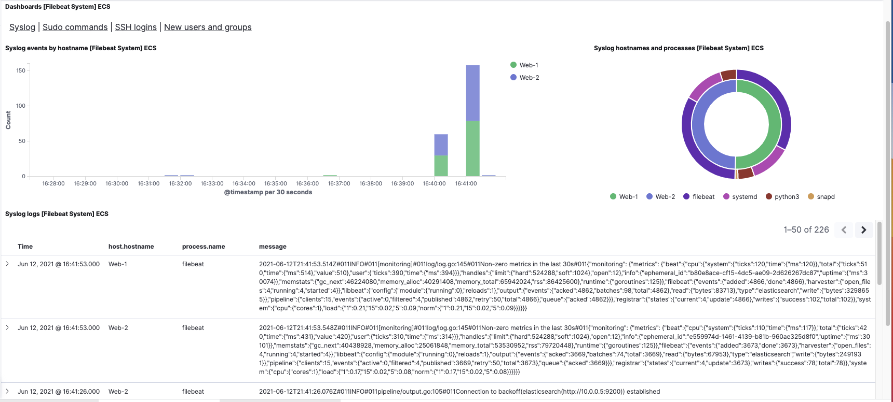
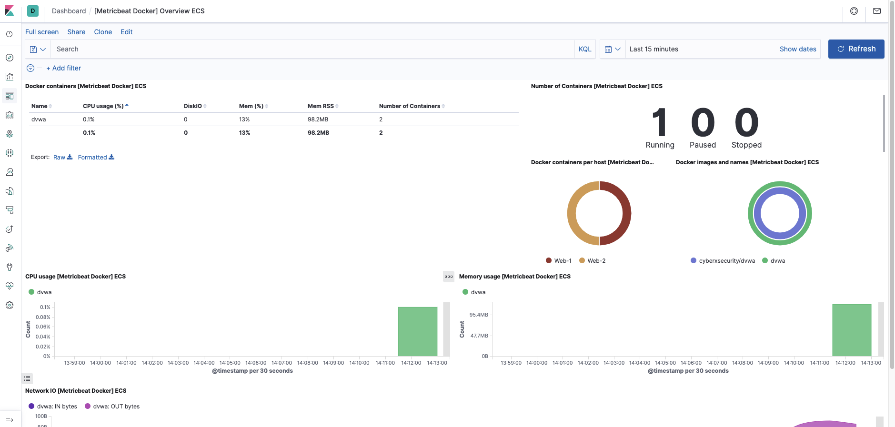
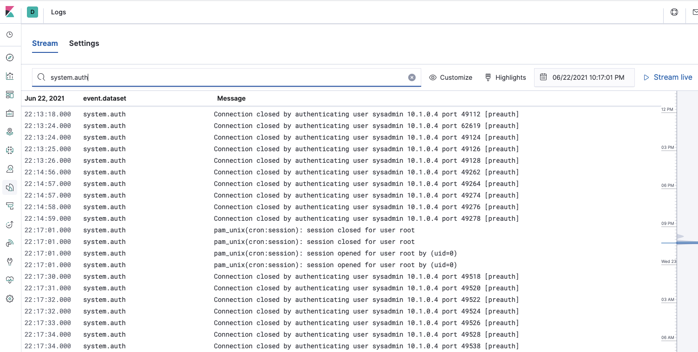

## Automated ELK Stack Deployment

The files in this repository were used to configure the network depicted below.

These files have been tested and used to generate a live ELK deployment on Azure. They can be used to either recreate the entire deployment pictured above. Alternatively, select portions of the playbook file may be used to install only certain pieces of it, such as Filebeat.

  - ### Playbook Files

    - #### Config_VMs_Docker.yml
    
           ---
           - name: Config Web VM with Docker
             hosts: webservers
             become: true
             tasks:

               - name: uninstall apache httpd
                 apt:
                   name: apache2
                   state: absent

               - name: docker.io
                 apt:
                   update_cache: yes
                   name: docker.io
                   state: present

               - name: pip3
                 apt:
                   name: python3-pip
                   state: present

               - name: install docker pip module
                 pip:
                   name: docker
                   state: present

               - name: download and install dvwa cyberxsecurity/dvwa
                 docker_container:
                   name: dvwa
                   image: cyberxsecurity/dvwa
                   state: started
                   restart_policy: always
                   published_ports: 80:80

               - name: Enable docker service is started
                 systemd:
                   name: docker
                   enabled: yes
    
    
    - #### install-elk.yml
    
           ---
           - name: Elk Installation playbook
             hosts: elk
             remote_user: sysadmin
             become: true
             tasks:

               - ansible.posix.sysctl:
                 name: vm.max_map_count
                 value: 262144
                 state: present
                 sysctl_file: /etc/sysctl.conf

               - name: docker.io
                 apt:
                   update_cache: yes
                   force_apt_get: yes
                   name: docker.io
                   state: present

               - name: pip3
                 apt:
                   name: python3-pip
                   state: present

               - name: install docker pip module
                 pip:
                   name: docker
                   state: present

               - name: Install Elk
                 docker_container:
                   name: elk
                   image: sebp/elk:761
                   state: started
                   restart_policy: always
                   ports:
                     - "5601:5601"
                     - "9200:9200"
                     - "5044:5044"

               - name: Enable docker service is started
                 systemd:
                   name: docker
                   enabled: yes
             
             
    - #### filebeat-playbook.yml

          ---
          - name: installing and launching filebeat
            hosts: webservers
            become: yes
            tasks:

              - name: download filebeat deb
                command: curl -L -O https://artifacts.elastic.co/downloads/beats/filebeat/filebeat-7.4.0-amd64.deb

              - name: install filebeat deb
                command: dpkg -i filebeat-7.4.0-amd64.deb

              - name: drop in filebeat.yml
                copy:
                  src: /etc/ansible/files/filebeat-config.yml
                  dest: /etc/filebeat/filebeat.yml

              - name: enable and configure system module
                command: filebeat modules enable system

              - name: setup filebeat
                command: filebeat setup

              - name: start filebeat service
                command: service filebeat start

              - name: enable service filebeat on boot
                systemd:
                  name: filebeat
                  enabled: yes
                
                
    - #### metricbeat-playbook.yml

          ---
          - name: installing and launching metricbeat
            hosts: webservers
            become: yes
            tasks:

              - name: Download metricbeat .deb file
                command: curl -L -O https://artifacts.elastic.co/downloads/beats/metricbeat/metricbeat-7.4.0-amd64.deb

              - name: Install 7.4.0
                command: dpkg -i metricbeat-7.4.0-amd64.deb

              - name: Drop in metricbeat.yml
                copy:
                  src: /etc/ansible/files/metricbeat-config.yml
                  dest: /etc/metricbeat/metricbeat.yml

              - name: enable and configure system module
                command: metricbeat modules enable docker

              - name: Setup metricbeat
                command: metricbeat setup

              - name: Start metricbeat service
                command: service metricbeat start

This document contains the following details:
- Description of the Topology
- Access Policies
- ELK Configuration
  - Beats in Use
  - Machines Being Monitored
- How to Use the Ansible Build

### Description of the Topology

The main purpose of this network is to expose a load-balanced and monitored instance of DVWA, the D*mn Vulnerable Web Application.

Load balancing ensures that the application will be highly available, in addition to restricting access to the network.
- Load balancers protect the availability aspect of the security CIA triad, allowing to increase capacity and reliability of applications. 
- A Jump Box is useful because it controls access to other machines by allowing connections from specific IP addresses, forcing the traffic to pass through a single node. It also helps to identify and monitor remote connections. 

Integrating an ELK server allows users to easily monitor the vulnerable VMs for changes to the configuration and system files.
- Filebeat monitors the log files, collect log events and forwards them to other solutions such as Elasticsearch or Logstash for indexing.   
- Metricbeat takes the metrics and statistics from the operating system (CPU usage, memory, etc.) and from services running on the VMs. 

The configuration details of each machine may be found below.

| Name       | Function | IP Address | Operating System |
|------------|----------|------------|------------------|
| Jump Box   | Gateway  | 10.1.0.4   | Linux            |
| Web-1      | DVWA     | 10.1.0.5   | Linux            |
| Web-2      | DVWA     | 10.1.0.6   | Linux            |
| ELK Server | ELK      | 10.0.0.5   | Linux            |

### Access Policies

The machines on the internal network are not exposed to the public Internet. 

Only the Jump Box machine can accept SSH connections from the Internet. Access to this machine is only allowed from the following IP addresses:

- Public IP: 143.131.14.40/32

Machines within the network can only be accessed by the Jump Box machine.

- The Jump Box can access the ELK Server (with IP 10.0.0.5) using a SSH conection. The Jump Box's IP address is 10.1.0.4 

A summary of the access policies in place can be found in the table below.

| Name                           | Publicly Accessible | Allowed IP Addresses                       |
|--------------------------------|---------------------|--------------------------------------------|
| Jump Box                       | Yes                 | 143.131.14.40/32 port 22                   |
| Web-1                          | Yes                 | 10.1.0.4 port 22                           |
| Web-2                          | Yes                 | 10.1.0.4 port 22                           |
| ELK Server                     | Yes                 | 143.131.14.40/32 port 5601                 |
| Virtual Network  (10.1.0.0/16) | Yes                 | 143.131.14.40/32 port 80                   |

### Elk Configuration

Ansible was used to automate configuration of the ELK machine. No configuration was performed manually, which is advantageous because:
- Automation simplifies the process of configuration and updates, ensuring it is done in a consistent way.
- It also increases efficiency of the development and administration team.
- No special coding skills are needed. 

The playbook implements the following tasks:

- Playbook 1: Config_VMs_Docker.yml

This playbook is used to install Docker and configure the VMs (Web-1 and Web-2) with the DVWA web application. The following tasks were performed:

    - Installation of docker.io with the Ansible apt module
    - Installation of python3-pip with the Ansible apt module
    - Installation of docker with the Ansible pip module
    - Installation of the cyberxsecurity/dvwa container with the Ansible docker-container module.
    - Initiation of the docker service by using the ansible systemd module.

- Playbook 2: install-elk.yml

This playbook is used to set up the ELK server using a docker container. The following tasks were performed:

    - Installation of docker.io with the Ansible apt module
    - Installation of python3-pip with the Ansible apt module
    - Installation of docker with the Ansible pip module
    - Installation of the ELK container and the definition of the ports used. 
    - Increase of the memory to support the ELK stack. 
    - Initiation of the docker service by using the ansible systemd module.

- Playbook 3: filebeat-playbook.yml

This playbook is used to deploy Filebeat on each web server so they are monitored. The following tasks were performed: 

    - Download and Installation of Filebeat deb.
    - Configuration of Filebeat. 
    - Enabling and configuration of the system module.

- Playbook 4: metricbeat-playbook.yml

This playbook is used to deploy Metricbeat on each web server so they are monitored. The following tasks were performed:

    - Download and Installation of Metricbeat deb.
    - Configuration of Metricbeat. 
    - Enabling and configuration of the system module.

The following screenshot displays the result of running `docker ps` after successfully configuring the ELK instance.

### Target Machines & Beats

This ELK server is configured to monitor the following machines:

    - Web-1: 10.1.0.5
    - Web-2: 10.1.0.6

We have installed the following Beats on these machines:

    - Filebeat
    - Metricbeat

These Beats allow us to collect the following information from each machine:

- Filebeat monitors log files and collect log events from the VMs. E.g., Filebeat collects failed access attemps to each Web server.     
- Metricbeat takes metrics and statistics from the operating system (CPU usage, memory, etc.) and from services running on the VMs. E.g., Metricbeat shows the CPU usage of each web server.  

### Using the Playbook
In order to use the playbook, you will need to have an Ansible control node already configured. Assuming you have such a control node provisioned: 

SSH into the control node and follow the steps below:
- Copy the playbook files to the Ansible Docker container.
- Update the Ansible hosts file `/etc/ansible/hosts` to include the following:

  - As part of the webservers group:
  
        [webservers]
        - 10.1.0.6 ansible_python_interpreter=/usr/bin/python3
        - 10.1.0.5 ansible_python_interpreter=/usr/bin/python3

  - As part of the ELK servers group: 
  
        [elkservers]
        - 10.0.0.5 ansible_python_interpreter=/usr/bin/python3

- Update the Ansible configuration file `/etc/ansible/ansible.cfg` by setting the remote admin user name:
  - `remote_user = sysadmin`

- Run each playbook with the command `ansible-playbook playbook_name.yml`, and navigate to Kibana to check that the installation worked as expected.

The specific commands are required to run the playbooks and navigate trough Kibana:  

  1. Initiate a SSH session to the Jump Box. `~$ ssh azdmin@168.62.22.230`
      - `168.62.22.230` corresponds to the Jump Box public IP
      
  2. Start and attach the respective Ansible Docker container
    - `azdmin@Jump-Box-Provisioner:~$ sudo docker start festive_hopper`
      - `festive_hopper` is the name of the docker container used in this project
    - `azdmin@Jump-Box-Provisioner:~$ sudo docker attach festive_hopper`
    
  3. Check if there is a docker container running with the following command:
      - `azdmin@Jump-Box-Provisioner:~$ sudo docker ps`
      - The docker container ID can be identified with the previous command. This ID will let the user understand when he has had access to the container. 
      - In this case, the container ID is `0851ac406ceb`.
      
  4. Go to `/etc/ansible` directory and Update the config files (`filebeat-config.yml` and `metricbeat-config.yml)` to include the ELK-server's private IP address.
  
  5. Make sure the files `filebeat-config.yml` and `metricbeat-config.yml` are located in the correct directory. 
  This location is defined on the `filebeat-playbook.yml` and `metricbeat-playbook.yml` files at the "drop in" package definition.
      
  6. The playbooks can be run with the following commands on the `/etc/ansible` location:
  
    - root@0851ac406ceb:/etc/ansible# ansible-playbook Config_VMs_Docker.yml
    - root@0851ac406ceb:/etc/ansible# ansible-playbook install-elk.yml
    - root@0851ac406ceb:/etc/ansible# ansible-playbook filebeat-playbook.yml
    - root@0851ac406ceb:/etc/ansible# ansible-playbook metricbeat-playbook.yml
  
  7. Once the playbooks have been launched and no errors are triggered, navigate to Kibana to check that the installation worked as expected.
  
  Now, Filebeat and Metricbeat data and reports can be seen at Kibana.
   
   - Kibana can be accessed at `http://<elk-server-ip>:5601/app/kibana`
    
   - After Kibana has been configured, Filebeat and Metricbeat data will appear for the first time similar to the following images: 
    
   ##### Filebeat
   
   
   
   ##### Metricbeat
   
   
    
   
   
   The following is an example of the logs captured by Kibana, when a high amount of failed SSH login attempts where generated on one of the VM Web servers:
   
   
   
   
 ####  Kibana
    
Kibana offers different features. The main feaures used during this implementation were `Metrics` and `Logs`. However, Kibana also creates Charts, Dashboards, Maps to identify what country the network traffic is coming from, SIEM solution, application monitoring, among others. Kibana permits to obtain valuable information to conduct analysis and investigation over different IT company assets. It also permits adding sample data, for example from a Web Server to visualize and interact with the different features and data. 

